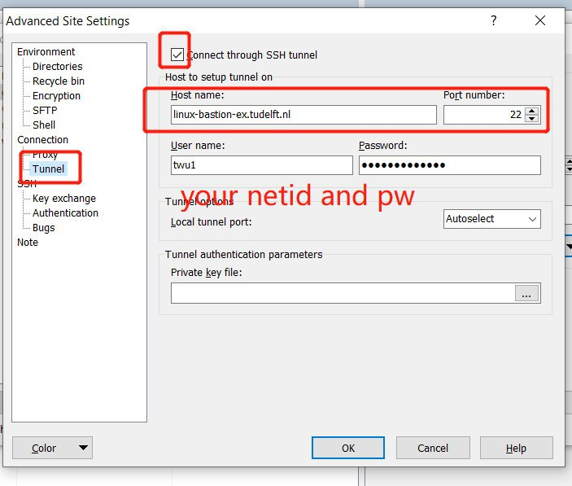

# Connecting to a Linux server with ssh


Due to security measures, you cannot connect directly with your password. Here is how to set this up on a UNIX-like system (`Linux` and `macOS`).

## Configuration

1. In your local computer, type `ssh-keygen -t ed25519` and follow the instructions. It is recommended to use a password to protect your keys. You'll have to use this password everytime you login after you are done, or you can use `ssh-add` to store it (once after you restart your computer).

2. Create a file named `config` in your `~/.ssh` folder (or, just `vim ~/.ssh/config`) and put the following content:

    ```
    Host bastionex
      Hostname linux-bastion-ex.tudelft.nl
      User netid

    Host godzilla
      Hostname godzilla.bk.tudelft.nl
      ProxyCommand ssh -W %h:%p bastionex
      User gUsername

    Host website
      Hostname 3d.bk.tudelft.nl
      ProxyCommand ssh -W %h:%p bastionex
      User wUsername
    ```

    Replace `netid` with your netid, `gUsername` with your username in godzilla and `wUsername` with your username in the website server.

3. Copy your public key (as created in step 1) to all three servers respectively. So:
    - `ssh-copy-id bastionex` and give your TU Delft password when prompted.
    - `ssh-copy-id godzilla` and give your keys password (set in step 1) and then your godzilla password.
    - `ssh-copy-id website` and your keys password (set in step 1) and then your website password.

    Beware you might be prompted for the password of your ssh keys multiple times before you are asked for the actual password of the respective user in each server.

## Usage

As soon as your `~/.ssh/config` is defined and your public key is copied correctly, you should be able to login to godzilla or the website with the respective commands:
- `ssh godzilla`
- `ssh website`

## Transferring files

We suggest you use `rsync` command in the terminal for file transfer. To transfer a whole directory **to** a remote machine, use the following syntax:

```
rsync -azhP foo/bar remote_host:/folder/in/remote/
```

To transfer contents of a directory, but not the directory itself, add a trailing slash `/`. For example, to transfer the contents of a directory to 'gilfoyle', you can type

```
rsync -azhP foo/bar/ gilfoyle:/home/myusername/
```

To transfer a whole directory **from** a remote to your current directory, type:

```
rsync -azhP remote_host:/folder/in/remote .
```

If you don't have a Host defined in .ssh/config file, you must use username@remote_host identifier as 'remote_host'.

Few notes about rsync:
- It 'synchronizes' files between two computers. This means if two files are the same (name, size, date) it will skip them. Useful when you only want to update the whole folder with new files.
- In the `-azhP` options `a` preserves all information on files from the host, `z` compresses files before sending, `h` shows human-readable form, and `P` allows a continuation of partially transferred files (in case your connection breaks).

## Comments

- For students, bastionex is not accesible. They have to request for an account in student-linux.tudelft.nl and then the configuration above should be change to use that hostname instead.
- On `Windows` it should be possible to do similar things with `puttyssh` and `puttyagent`. Another alternative is to install `Windows Subsystem for Linux` and some Linux distribution (e.g. `Ubuntu`) and follow the same instructions above.
- To copy files using a graphic interface use WinSCP, and configure a session following the figures here: 


